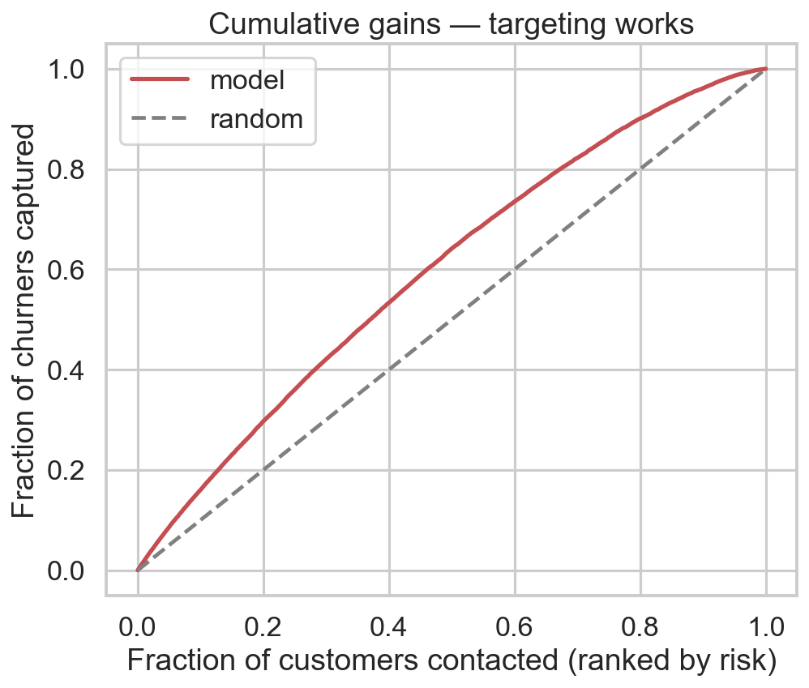
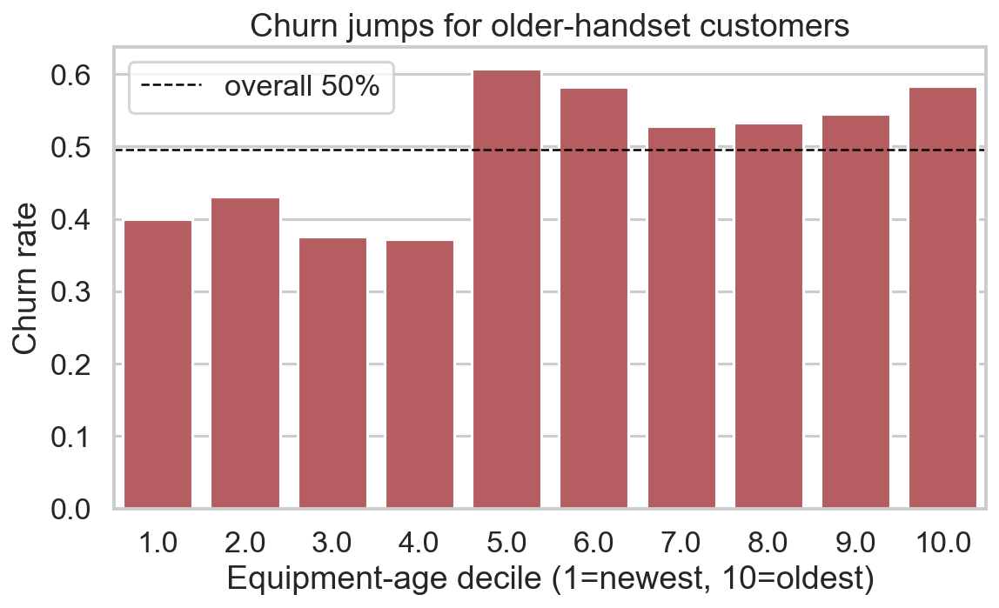
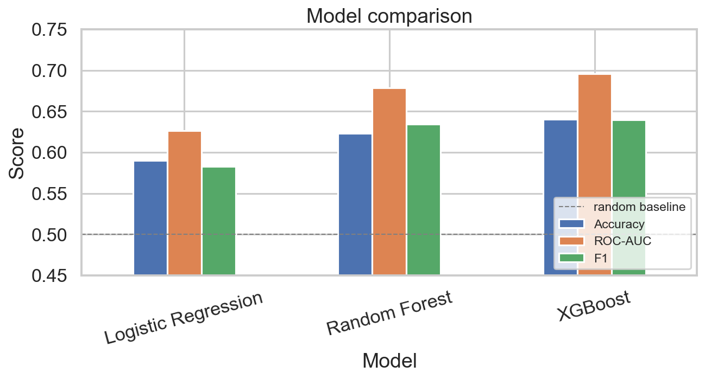

# Value-Weighted Telecom Churn Retention

**Rank 100,000 telecom customers by churn risk, then turn those risk scores into a dollar-weighted
retention plan** — who to contact, how many churners you catch, and the projected ROI of the campaign.

> 🔗 **Live interactive report:** **<https://akhillavudya.github.io/telecom-churn-retention/>** — Quarto report with an Observable JS ROI calculator (sliders → live net benefit / ROI), hosted static on GitHub Pages.
> 📊 **Slide deck:** [`reports/slides.pdf`](reports/slides.pdf) (15 slides).

---

## TL;DR — headline results

| Question | Answer |
|---|---|
| Can we predict churn? | **XGBoost, ROC-AUC ≈ 0.70** (Accuracy 0.64, F1 0.64) vs a 0.50 random baseline — modest but honestly reported. |
| Does the ranking help us act? | The **top risk decile churns at 79.5%**; contacting the **top 20% by risk captures ~30% of all churners** (cumulative gains). |
| Is it worth doing? | On a 100K book, a targeted campaign is **projected** to retain **$3.07M/yr in revenue** for **$2.07M/yr net benefit** — a **2.1× ROI** on ~$1.0M spend. |

> ⚠️ The model metrics are **real** (held-out test set). The dollar figures are a **projection from
> stated assumptions**, not a delivered campaign result. See the [Honesty box](#honesty--provenance).

---

## The business problem

A telecom operator ("Company A") loses revenue when customers churn. Retention offers cost money, so
blasting everyone is wasteful. The analytics question is therefore not just *"who will churn?"* but
*"which customers are worth contacting?"* — a **value-weighted targeting** problem: concentrate a
fixed retention budget on the high-risk, high-value customers where an offer pays for itself.

## The data

- **Two tables, ~100,000 customers, ~200,000 rows**, joined on `Customer_ID`:
  - `Client.csv` — customer attributes.
  - `Record.csv` — usage / billing / service records.
- Roughly **50/50 churn balance**, so accuracy is a meaningful (if limited) metric.
- **6 domain features** engineered from the raw columns (equipment age, overage exposure, support
  friction, etc.).
- Column meanings: [`data/data_dictionary_source.docx`](data/data_dictionary_source.docx).

> The raw GCI dataset is **not redistributed here** (licensing unconfirmed) — `data/raw/*.csv` is
> git-ignored. See [How to run](#how-to-run) for obtaining the data.

## How to run

Reproduces all 11 figures and prints the headline numbers from a clean clone:

```bash
# 1. create an isolated environment
python -m venv .venv
.\.venv\Scripts\Activate.ps1        # Windows PowerShell
# source .venv/bin/activate         # macOS / Linux

# 2. install the exact pinned versions
pip install -r requirements.txt

# 3. place the raw data in data/raw/  (Client.csv, Record.csv)

# 4. run the pipeline
python src/analysis.py
```

Figures are regenerated into `reports/figures/`; a single seed (`RANDOM_STATE = 42`) makes every run
identical.

## Approach

1. **EDA** — churn balance, missingness, and how churn moves with equipment age and ARPU.
2. **Feature engineering** — 6 domain-driven features from the joined tables.
3. **Model comparison** — Logistic Regression, Random Forest, and **XGBoost** on a stratified 70/30
   split, with model-family-specific preprocessing and leak-free imputation. XGBoost selected.
4. **Targeting analysis** — a **decile lift table** and **cumulative-gains** curve translate raw
   probabilities into "contact the top X%, catch Y% of churners."
5. **Expected-value ROI** — combine the gains curve with offer cost, success rate, and value horizon
   into a projected net benefit, then stress-test it with a **sensitivity analysis**.

## Key results

**Targeting power — the top 20% of risk captures ~30% of churners:**



**Churn rises sharply with equipment age (the strongest single driver):**



**Model comparison — XGBoost wins across metrics:**



_All 11 figures are in [`reports/figures/`](reports/figures/)._

## Assumptions behind the ROI

The dollar figures follow from these stated inputs (all adjustable in the live calculator):

- Retention **offer cost: $50/customer**
- Offer **success rate: 30%**
- **Value horizon: 12 months**
- Average **ARPU of targeted churners: ~$58/month**

Full reasoning and citations: [`docs/REFERENCES_AND_ASSUMPTIONS.md`](docs/REFERENCES_AND_ASSUMPTIONS.md).

## Repository structure

```
├── data/                  # raw/ (git-ignored) + data dictionary
├── src/                   # reproducible pipeline (analysis, notebook builder, slides)
├── notebooks/             # exploratory churn_analysis.ipynb
├── reports/               # generated figures + slides.pdf + Quarto site (quarto/)
├── docs/                  # plan, audit, assumptions, per-step explanations
├── requirements.txt       # pinned dependencies
└── README.md
```

## Honesty & provenance

- **Provenance:** built from the **GCI World 2026 final assignment** dataset for "Company A." It is a
  portfolio project, not delivered consulting work.
- **Model metrics are real** — ROC-AUC ≈ 0.70 is measured on a held-out test set and reported as-is
  (a coin flip is 0.50; a perfect model is 1.0). It is a genuine, modest result, not inflated.
- **Dollar ROI is projected**, not achieved — it is arithmetic on the assumptions above applied to the
  model's rankings. Phrased throughout as *projected / modeled*, never *delivered*.

## Tech stack

Python · pandas · NumPy · scikit-learn · XGBoost · matplotlib · seaborn. Versions pinned in
[`requirements.txt`](requirements.txt).
