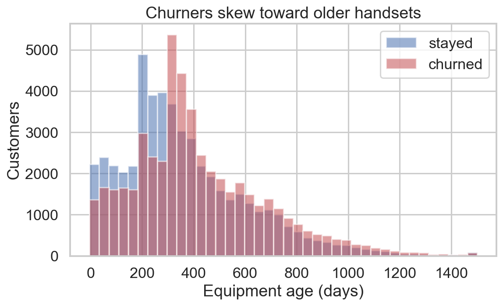
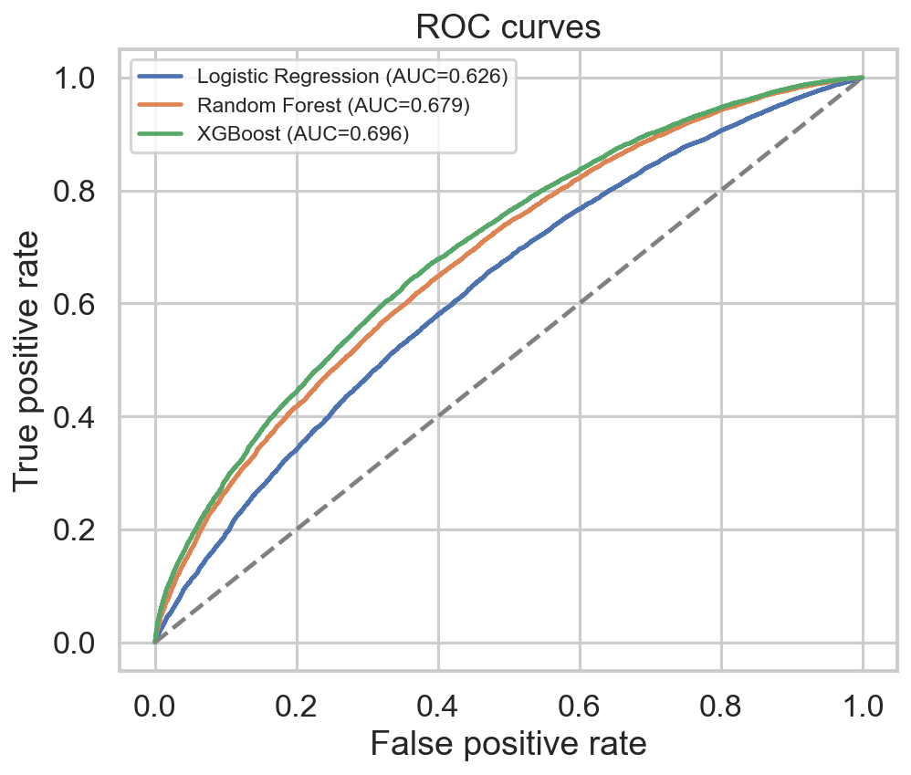
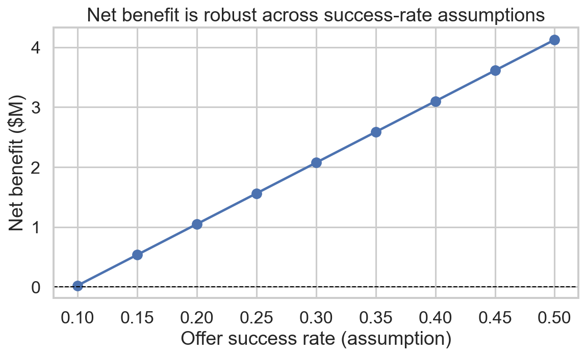

::: {.callout-note}
## The headline
An **XGBoost** model (ROC-AUC ≈ 0.70) ranks 100,000 telecom customers by churn risk. Contacting just
the **top 20% by risk captures ~30% of all churners** — which, under stated retention assumptions, is a
**projected $2.07M/yr net benefit (2.1× ROI)**. Model metrics are measured on a held-out test set; the
dollar figures are a projection from the assumptions shown below, not a delivered campaign result.
:::

## The business problem

A telecom operator ("Company A") loses recurring revenue whenever a customer churns. Retention offers
cost money, so contacting *everyone* is wasteful. The real question is not just **"who will churn?"**
but **"which customers are worth contacting?"** — a *value-weighted targeting* problem: point a fixed
retention budget at the customers who are both high-risk **and** high-value, where an offer pays for
itself.

This report walks the full analyst workflow: understand the data → find the churn drivers → compare
models → turn risk scores into a targeting plan → put a dollar figure on it.

## The data

- **Two tables, ~100,000 customers / ~200,000 rows**, joined on `Customer_ID` (customer attributes +
  usage/billing records).
- Roughly **50/50 churn balance**, so accuracy is a meaningful baseline metric.
- **6 domain features** engineered from the raw columns (equipment age, overage exposure, support
  friction, revenue-per-minute, and more).

## Churn drivers — what actually predicts churn

The single strongest signal is **equipment age** (`eqpdays`): the longer a customer has had the same
handset, the more likely they are to leave. Churn climbs steadily across equipment-age deciles.



Ranking customers into risk deciles by the model makes the targeting value concrete — the **top decile
churns at 79.5%**, more than 1.6× the average rate:


| Risk decile (1 = highest) | Customers | Churn rate | Avg ARPU | Lift vs. base |
|---|---|---|---|---|
| 1 | 3,000 | **79.5%** | $60.60 | 1.60× |
| 2 | 3,000 | 67.8% | $55.76 | 1.37× |
| 3 | 3,000 | 61.4% | $54.99 | 1.24× |
| 4 | 3,000 | 55.8% | $54.59 | 1.13× |
| 5 | 3,000 | 53.5% | $55.35 | 1.08× |
| … | … | … | … | … |
| 10 | 3,000 | 19.3% | $56.49 | 0.39× |

## Model comparison — why XGBoost

Three models were benchmarked on a stratified 70/30 split with model-family-specific preprocessing and
leak-free imputation. **XGBoost** won across metrics and was selected.




ROC-AUC ≈ **0.70** is a *modest but honest* result: it means that, given a random churner and a random
non-churner, the model ranks the churner as higher-risk about 70% of the time (0.50 would be a coin
flip). Modest AUC is fine here — the value comes from the *ranking*, which the next section cashes in.

## Targeting — the analyst headline

A **cumulative-gains** curve answers the money question directly: *if I contact the top X% by risk,
what fraction of all churners do I catch?* Contacting the **top 20% captures ~30% of churners** — well
above the 20% a random dialer would reach.


## The ROI case

Combining the gains curve with retention economics yields the projected business impact on the full
100,000-customer book:

| | |
|---|---|
| Customers contacted (top 20%) | ~20,000 |
| Churners caught | ~14,730 |
| Customers actually saved (30% success) | ~4,419 |
| Revenue retained (12-mo horizon) | **$3.07M** |
| Campaign cost ($50 × 20,000) | $1.00M |
| **Net benefit** | **$2.07M** |
| **ROI** | **2.1×** |

The two "soft" inputs — offer cost and success rate — are **assumptions**, not measured values. So the
case is stress-tested with a sensitivity analysis: net benefit stays positive across a wide range of
success-rate assumptions.



## Interactive ROI calculator {#calculator}

Every number in the ROI table above rests on four assumptions. Rather than trust one scenario, **drag
the sliders** and watch customers saved, net benefit, and ROI recompute live. This runs entirely in
your browser — the math is pure arithmetic on the precomputed gains curve, so there is no server and no
model hosting.

```{ojs}
//| echo: false
// Load the precomputed aggregates (gains curve + default assumptions) into the browser.
data = FileAttachment("data.json").json()
```

```{ojs}
//| echo: false
// Four assumption sliders; each `viewof` is a live variable the calculator reads.
viewof offer_cost = Inputs.range([10, 150], {value: data.defaults.offer_cost, step: 5, label: "Offer cost ($ / customer)"})
```

```{ojs}
//| echo: false
viewof success_rate = Inputs.range([0.05, 0.6], {value: data.defaults.success_rate, step: 0.01, label: "Success rate (fraction retained)"})
```

```{ojs}
//| echo: false
viewof horizon_months = Inputs.range([1, 36], {value: data.defaults.horizon_months, step: 1, label: "Value horizon (months)"})
```

```{ojs}
//| echo: false
viewof target_fraction = Inputs.range([0.01, 1.0], {value: data.defaults.target_fraction, step: 0.01, label: "Target fraction (top % by risk)"})
```

```{ojs}
//| echo: false
// Pick the gains-curve row closest to a given target fraction.
rowAt = (t) => data.curve.reduce((a, b) => Math.abs(b.frac - t) < Math.abs(a.frac - t) ? b : a)
```

```{ojs}
//| echo: false
// Turn one set of assumptions into the full expected-value result (mirrors analysis.py:305-320).
economics = function (t, offer, success, horizon) {
  const row = rowAt(t);
  const contacted = row.contacted_full;
  const caught = row.churners_caught_full;
  const arpu = row.arpu_caught;
  const saved = caught * success;
  const revenue = saved * arpu * horizon;
  const cost = contacted * offer;
  const net = revenue - cost;
  return {contacted, caught, arpu, saved, revenue, cost, net, roi: net / cost};
}
```

```{ojs}
//| echo: false
r = economics(target_fraction, offer_cost, success_rate, horizon_months)
```

```{ojs}
//| echo: false
usd = d3.format("$,.0f")
```

```{ojs}
//| echo: false
// Live result cards; the border of the net-benefit card turns red if the campaign loses money.
html`<div style="display:grid; grid-template-columns:repeat(auto-fit, minmax(150px, 1fr)); gap:12px; margin:1rem 0;">
  ${[
    ["Customers contacted", d3.format(",.0f")(r.contacted), "top " + d3.format(".0%")(target_fraction) + " by risk"],
    ["Churners caught", d3.format(",.0f")(r.caught), d3.format(".0%")(r.caught / data.total_churners_full) + " of all churners"],
    ["Customers saved", d3.format(",.0f")(r.saved), d3.format(".0%")(success_rate) + " retention success"],
    ["Revenue retained", usd(r.revenue), "$" + d3.format(".0f")(r.arpu) + "/mo x " + horizon_months + " mo"],
    ["Campaign cost", usd(r.cost), "$" + offer_cost + " x " + d3.format(",.0f")(r.contacted)],
    ["Net benefit", usd(r.net), "ROI " + d3.format(".1f")(r.roi) + "x"]
  ].map(([label, value, sub]) => html`<div style="border:1px solid ${label === "Net benefit" && r.net < 0 ? "#d33" : "#ccc"}; border-radius:8px; padding:12px;">
      <div style="font-size:.8rem; color:#666;">${label}</div>
      <div style="font-size:1.4rem; font-weight:700; color:${label === "Net benefit" ? (r.net < 0 ? "#d33" : "#1a7f37") : "inherit"};">${value}</div>
      <div style="font-size:.75rem; color:#888;">${sub}</div>
    </div>`)}
</div>`
```

```{ojs}
//| echo: false
// Net benefit across every targeting depth for the current sliders; the red dot is your choice.
Plot.plot({
  marginLeft: 60,
  x: {label: "Fraction of customers contacted →", tickFormat: "%", grid: true},
  y: {label: "Net benefit ($M)", grid: true},
  marks: [
    Plot.ruleY([0], {stroke: "#999"}),
    Plot.line(data.curve, {x: "frac", y: (d) => economics(d.frac, offer_cost, success_rate, horizon_months).net / 1e6, stroke: "#1a7f37", strokeWidth: 2.5}),
    Plot.dot([{frac: target_fraction, net: r.net / 1e6}], {x: "frac", y: "net", fill: "#d33", r: 6}),
    Plot.text([{frac: target_fraction, net: r.net / 1e6}], {x: "frac", y: "net", text: (d) => usd(r.net), dy: -14, fill: "#d33", fontWeight: 700})
  ]
})
```

::: {.callout-note}
The default sliders reproduce the report's headline: **~$2.07M net benefit at 2.1× ROI**. Notice the
curve peaks near the middle — contacting *too many* customers spends offer budget on low-risk people,
while contacting too few leaves saveable churners on the table.
:::

## Honesty & provenance

- Built from the **GCI World 2026** final-assignment dataset for "Company A." A portfolio project, not
  delivered consulting work.
- **Model metrics are real** — measured on a held-out test set and reported as-is (AUC 0.70 is genuine
  and modest, not inflated).
- **Dollar ROI is projected** — arithmetic on the stated assumptions applied to the model's rankings.
  Described throughout as *projected/modeled*, never *delivered*.
